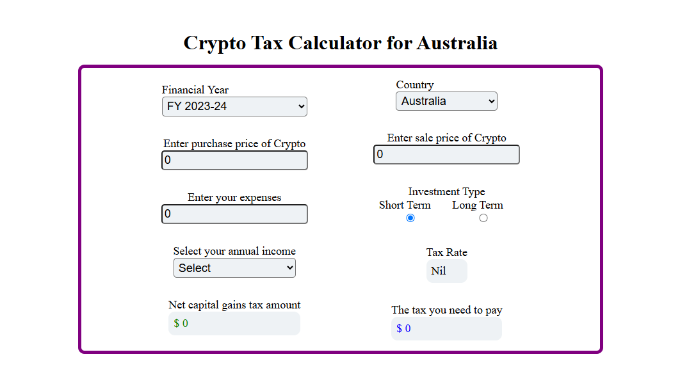

# 🇦🇺 Free Crypto Tax Calculator for Australia

A responsive and user-friendly crypto tax calculator specifically designed for Australian users. This tool helps users estimate their crypto capital gains tax based on sale price, purchase price, expenses, investment type, and annual income, following Australian tax regulations.

---

## UI Preview

## 🧮 Features

- Dynamic tax rate calculation based on Australian income tax slabs.
- Support for both **Long Term** and **Short Term** crypto investments.
- Accurate calculation of:
  - **Capital Gains Amount**
  - **Discount for Long Term Gains**
  - **Net Capital Gains**
  - **Tax Payable**
- Form fields include:
  - Purchase Price
  - Sale Price
  - Expenses
  - Investment Type (Short Term / Long Term)
  - Annual Income (predefined income brackets)
- Auto-updating tax calculations as inputs change.
- Responsive design compatible with mobile, tablet, and desktop.

---

## 📊 Tax Calculation Logic

### Input Fields:
- **Purchase Price**: Initial cost of the crypto.
- **Sale Price**: Selling price of the crypto.
- **Expenses**: Additional costs such as exchange or transaction fees.
- **Investment Type**:
  - **Long Term** (held > 12 months): eligible for 50% discount on gains.
  - **Short Term** (held ≤ 12 months): no discount.
- **Annual Income**: Predefined dropdown matching ATO tax brackets.

---

### Calculation Breakdown

#### 1. **Capital Gains Amount**  
\[
\text{Capital Gains} = \text{Sale Price} - \text{Purchase Price} - \text{Expenses}
\]

#### 2. **Long Term Discount**
- Applies only if **Investment Type = Long Term** and **Capital Gains > 0**
- \[
\text{Discount} = \text{Capital Gains} \times 50\%
\]

#### 3. **Net Capital Gains**
- **Long Term**:  
  \[
  \text{Net Capital Gains} = \text{Capital Gains} - \text{Discount}
  \]
- **Short Term**:  
  \[
  \text{Net Capital Gains} = \text{Capital Gains}
  \]

#### 4. **Tax Rate & Tax Payable**
Based on **Annual Income**, tax is calculated using the Australian income tax brackets. For example:

- **$45,001 – $120,000**  
  \[
  \text{Tax Rate} = \$5,092 + 32.5\% \text{ of excess over \$45,000}
  \]  
  Applied to Net Capital Gains:
  \[
  \text{Tax to be Paid} = \text{Net Capital Gains} \times 32.5\%
  \]

---

### 📌 Example

| Field               | Value                |
|--------------------|----------------------|
| Purchase Price      | $50                  |
| Sale Price          | $100                 |
| Expenses            | $20                  |
| Investment Type     | Long Term            |
| Annual Income       | $45,001 - $120,000   |

**Calculation:**

- Capital Gains = 100 - 50 - 20 = **30**
- Long Term Discount = 50% of 30 = **15**
- Net Capital Gains = 30 - 15 = **15**
- Tax = 32.5% of 15 = **4.875**

